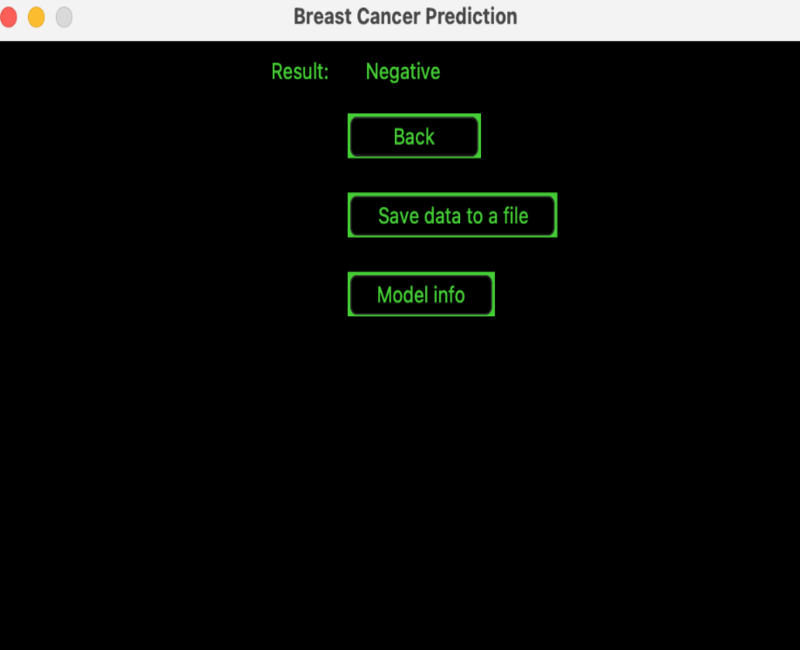
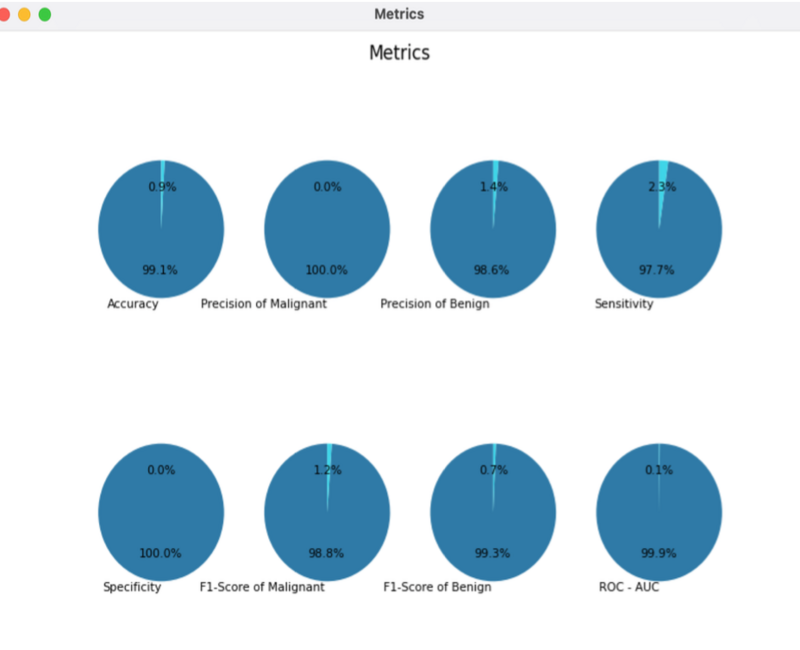

# Breast Cancer Prediction Application using Machine Learning Classifiers
> This project focuses on the development of an application for breast cancer prediction using machine learning techniques.

## Table of Contents
* [General Info](#general-information)
* [Technologies Used](#technologies-used)
* [Features](#features)
* [Screenshots](#screenshots)
* [Setup](#setup)
* [Project Status](#project-status)
<!-- * [License](#license) -->

## General Information
This project, developed as part of an engineering thesis, presents an application for breast cancer identification. The application is designed to assist doctors in diagnosing breast cancer by analyzing results from fine-needle aspiration biopsy tests. 
The project involved conducting exploratory analysis (analysis.py) on the Wisconsin Diagnostic Breast Cancer (WDBC) dataset. You can access the WDBC dataset [here](https://archive.ics.uci.edu/dataset/17/breast+cancer+wisconsin+diagnostic). Four machine learning classifiers were trained: logistic regression, SVM, decision tree, and random forest. Classifier validation was conducted, leading to the selection of logistic regression as the model to be used in the application (model.py). An application for breast cancer identification was built, featuring an intuitive graphical interface (gui.py) created using the Tkinter library.

## Technologies Used
- Python - version 3.11.0
- Scikit-learn - version 1.3.2
- Pandas - version 2.0.2
- Numpy - version 1.23.5
- Matplotlib - version 3.7.1
- SciPy - version 1.11.3
- Seaborn - version 0.13.0
- Joblib - version 1.3.2

## Features
- Graphical interface for easy use by medical professionals.
- Allows input patient information and examination date.
- Allows input examination results manually or from a CSV file.
- Displays diagnostic result.
- Allows saving diagnostic result along with patient data to an Excel file.
- Provides option to display evaluation metrics of the classifier used in the application.
- Prevents user input errors with informative prompts.

## Screenshots

<!-- If you have screenshots you'd like to share, include them here. -->

## Setup
To set up the project, follow these steps:

- Make sure you have the Python interpreter installed on your computer. You can download the latest version from Python.org. 
- Clone the repository: git clone 'https://github.com/akiszkiel/Breast-Cancer-Prediction-App.git'.
- Install dependencies: 'pip install -r requirements.txt'.
- Run the application: 'python gui.py'.

## Project Status
Project is: _complete_.

<!-- Optional -->
<!-- ## License -->
<!-- This project is open source and available under the [... License](). -->

<!-- You don't have to include all sections - just the one's relevant to your project -->